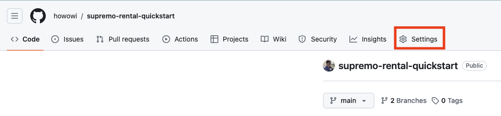
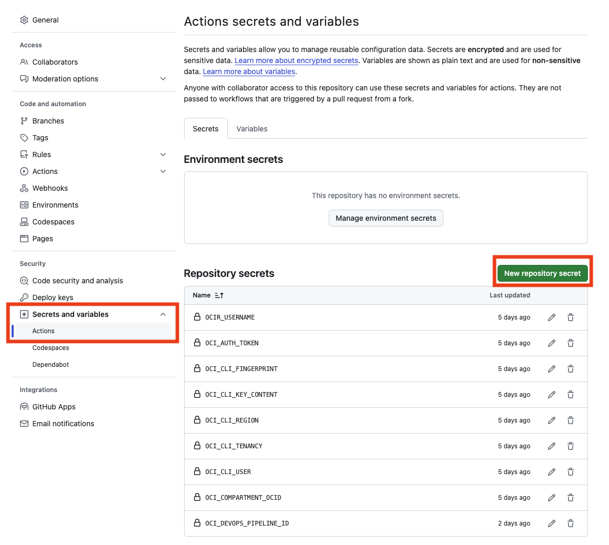
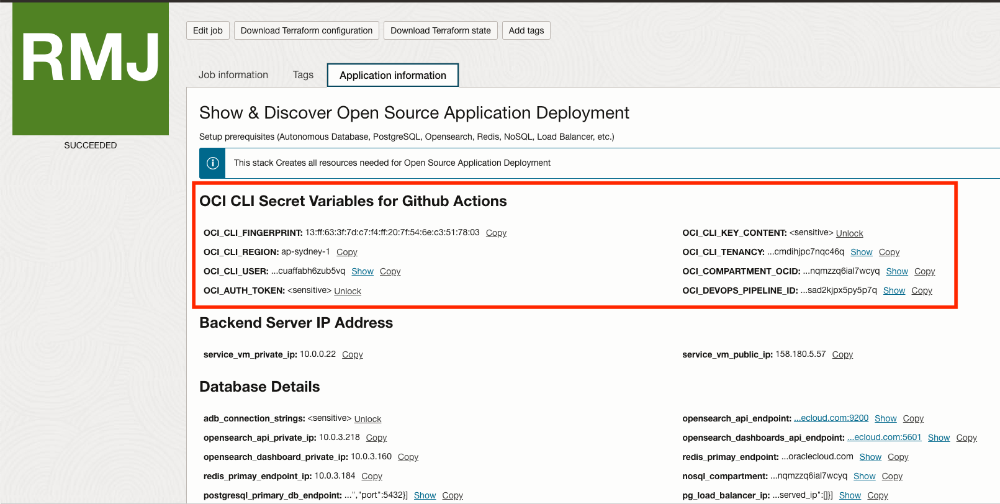
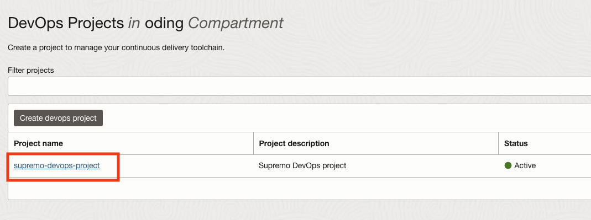
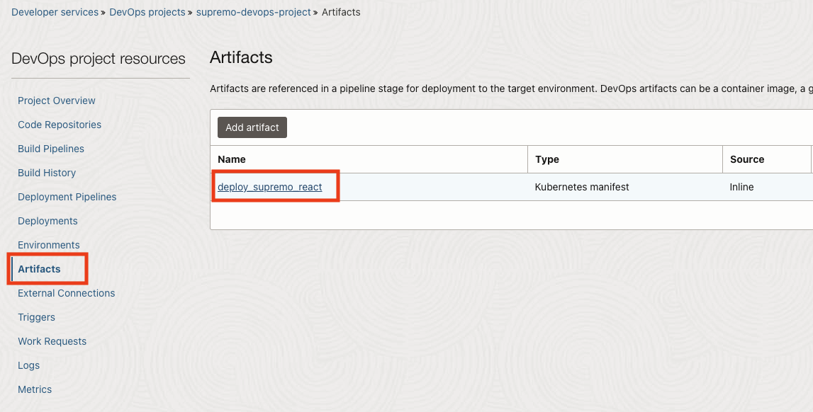
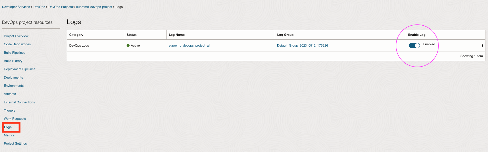
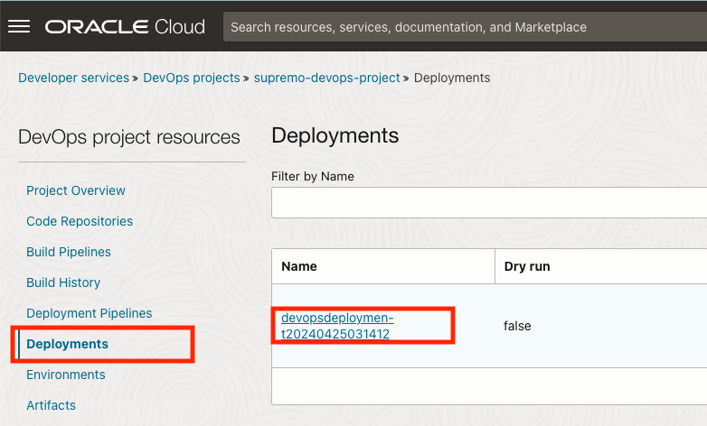
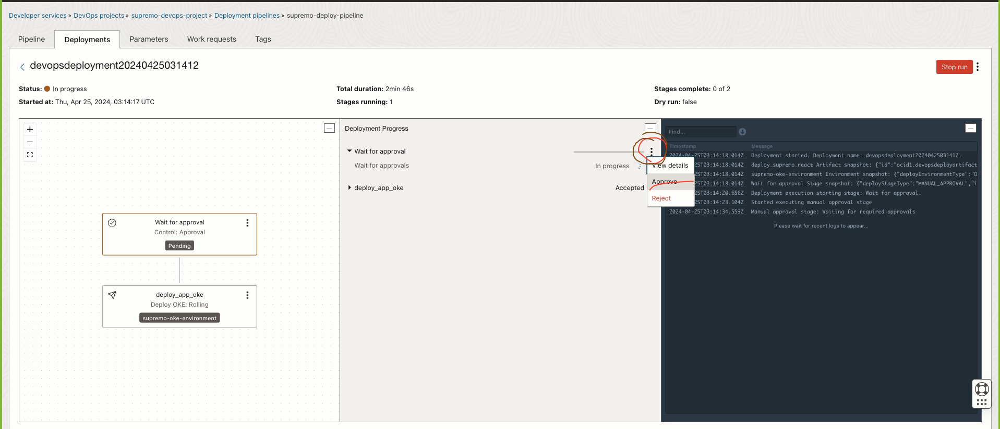
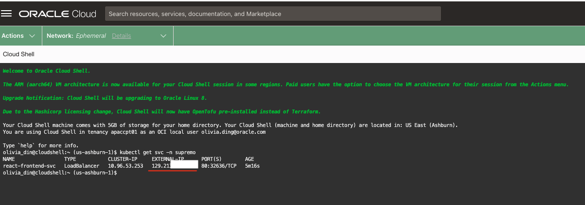

## App Deployment POC

### 1. Setup baseline infrastructure

Click on the button below to deploy the baseline infrastructure using OCI Resource Manager.

[](https://cloud.oracle.com/resourcemanager/stacks/create?zipUrl=https://github.com/howowi/oci-appdev-poc/releases/download/v0.0.5/poc_setup_v.0.0.5.zip)

### 2. Deploy your application to OKE via Github Actions and OCI DevOps
**IMPORTANT**: Must complete the baseline infrastructure setup before following the steps below.

#### Github Repository Setup

1. Navigate to Github repository settings.

    

2. Press "Actions" under "Secrets and variables" option.

    

3. Press "New repository secret" to create the following secrets.

    * OCI_CLI_FINGERPRINT (obtain from Resource Manager Outputs)
    * OCI_CLI_KEY_CONTENT (obtain from Resource Manager Outputs)
    * OCI_CLI_REGION (obtain from Resource Manager Outputs)
    * OCI_CLI_TENANCY (obtain from Resource Manager Outputs)
    * OCI_CLI_USER (obtain from Resource Manager Outputs)
    * OCI_COMPARTMENT_OCID (obtain from Resource Manager Outputs)
    * OCIR_USERNAME (Refer to [documentation](https://docs.oracle.com/en-us/iaas/Content/Registry/Tasks/registrypullingimagesusingthedockercli.htm))

        * **Example for non-federated user**: tenancynamespace/john@oracle.com
        * **Example for IDCS federated user**: tenancynamespace/oracleidentitycloudservice/john@oracle.com

    * OCI_AUTH_TOKEN (obtain from Resource Manager Outputs)
    * OCI_DEVOPS_PIPELINE_ID (obtain from Resource Manager Outputs)

    

#### OKE Setup

1. Create ephemeral network definition on Cloud Shell to acccess the private OKE cluster. Alternatively, use OCI Bastion.

    * Cloud Shell: Refer to [documentation](https://docs.oracle.com/en-us/iaas/Content/API/Concepts/cloudshellintro_topic-Cloud_Shell_Networking.htm#Cloud_Shell_Private_Access).

    * OCI Bastion: Refer to [documentation](https://docs.oracle.com/en-us/iaas/Content/ContEng/Tasks/contengsettingupbastion.htm#contengsettingupbastion_topic_Access_Kubernetes_API_endpoint).

2. Create namespace for your app
    ```
    kubectl create ns <app_namespace>
    ```

3. Create container registry secret to pull container image from OCI Container Registry. Refer to [documentation](https://docs.oracle.com/en-us/iaas/Content/Registry/Tasks/registrypullingimagesusingthedockercli.htm) for the values for `docker-username`, `docker-password` and `docker-server`.
    ```
    kubectl create secret docker-registry ocir-secret --docker-username='<tenancy_namespace>/<username>' --docker-password='<auth_token>' --docker-server=<region_code>.ocir.io --docker-email='<user_email>' -n <app_namespace>
    ```

4. Check that secret has been created
    ```
    kubectl get secrets -n <app_namespace>
    ```

#### OCI DevOps Setup

1. Navigate to OCI DevOps project.

    

2. Go to artifact and select "deploy_supremo_react".

    

3. Copy and paste the content of your Kubernetes deployment manifest file to the artifact and save it.

4. Go to Logs and make sure DevOps logs is enabled

    

#### Update Code and Run Github Action

1. Commit and push the code to Github repo main branch.

2. Observe that Github Action will be triggered and OCI Deployment Pipeline will deploy your app to the OKE cluster.

3. Navigate to OCI DevOps project and click on the deployment

    

4. Under Deployment Progress, click on the 3 dots of `Wait for approval`, press `Approve`.

    

5. After deployment is completed, validate that the app is accessible. Get the public IP of the load balancer by running the command below:
    ```
    kubectl get svc -n <app_namespace>
    ```

    